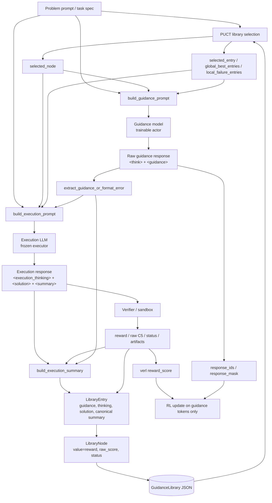

# Guidance-TTT Prompt Architecture

本文档按当前代码整理 `guidance-ttt` 的 prompt 架构，覆盖 guidance model、execution
model、execution 自总结、verifier 和 library writeback 的完整信息流。

代码来源：

- `guidance_ttt/prompts.py`: guidance/execution prompt 模板、raw summary attach、tag parser
- `guidance_ttt/agent_loop.py`: verl agent loop、模型调用、verification、canonical summary、library 写回
- `guidance_ttt/library.py`: PUCT node selection、visible context、JSON library
- `guidance_ttt/verifier/erdos.py`: Erdos verifier、reward/raw score 计算
- `guidance_ttt/verifier/sandbox.py`: `<solution>` / Python code 提取和 sandbox 执行

## Overall Structure



核心隔离规则：

```text
visible_timestep_exclusive = global_step
```

每个 rollout 只能看到 `timestep < global_step` 的 library 内容。同一个 training step 中刚
产生的其它 rollout 不会进入当前 prompt。

## One Rollout Flow

```text
GuidanceLibrary.acquire_group(group_uid, visible_timestep_exclusive=global_step)
  -> selected_node chosen by PUCT

GuidanceLibrary.context_for_node(selected_node, visible_timestep_exclusive=global_step)
  -> selected_entry
  -> global_best_entries
  -> local_failure_entries

build_guidance_prompt(...)
  -> guidance chat messages
  -> guidance model outputs <think>...</think> and <guidance>...</guidance>

extract_guidance_or_format_error(...)
  -> parsed guidance
  -> guidance_format_ok

build_execution_prompt(...)
  -> execution chat messages
  -> execution model outputs <execution_thinking>, <solution>, <summary>

verify_erdos_solution_text(execution_text)
  -> verifier status / raw C5 / reward / artifacts

build_execution_summary(...)
  -> canonical summary combining execution thinking, model summary, solution, guidance, verifier result

GuidanceLibrary.submit_child(...)
  -> write LibraryEntry and child LibraryNode
```

## Shared Library Context

Guidance prompt 和 execution prompt 来自同一次 PUCT selection 的同一个
`selected_node` / `selected_entry`，但 attach 的粒度不同。

共同来源：

```python
selected_node = library.acquire_group(...)
context = library.context_for_node(selected_node, ...)
selected_entry = context["selected_entry"]
global_best_entries = context["global_best_entries"]
local_failure_entries = context["local_failure_entries"]
```

- Guidance prompt 和 execution prompt 都只 attach raw `entry.summary`，不做 clipping、
  code removal、implementation fact extraction 或 profile compaction。
- 两个 prompt 都不 attach node id、visits、reward、raw score、verifier status/message、
  verified artifacts、previous guidance、reusable idea、failure mode 或 root initial
  construction facts。
- Execution prompt 额外 attach 当前 parsed `<guidance>`，用于把 guidance 落成具体代码。
- 当前 `lineage_entries` 会由 library context 返回，但没有直接写入 prompt。

## Summary Attach Rules

Guidance 和 execution prompt 都使用 `_raw_summary_for_prompt(entry, fallback=...)`。

没有 previous entry、summary 为 `None` 或 summary 为空字符串时：

```text
No previous summary is attached.
```

有 entry 且 summary 非空字符串时，直接输出原始 `entry.summary`：

```text
{entry.summary}
```

该 helper 不调用 `.strip()`、`_clip()` 或任何 summary processing helper；summary 中的
fenced code、硬编码数组、空白和换行都会原样进入 prompt。

## Guidance Model Prompt

Guidance model 是被 RL 训练的 actor。它不直接写最终 Python solution，而是输出下一步
搜索方向。verl 的 reward 最终只作用在 guidance model response tokens 上。

### Guidance System Prompt

```text
You are the Guidance Model, acting as a strategic navigator for an open-ended scientific discovery process.

Your primary objective is to provide **evolutionary guidance**. Do not write final code or focus on low-level implementation details. Instead, your task is to propose high-level directional shifts, conceptual mutations, and novel pathways to explore the search space.

Focus on how the current ideas can *evolve* to escape local optima and discover fundamentally new mechanisms.
```

### Guidance User Prompt

下面是 `build_guidance_prompt(...)` 当前构造的完整 user prompt。`{...}` 是运行时
Python f-string 插入的变量。

````text
<problem>
{problem_prompt}
</problem>

The next sections describe the current search state for this problem. Use them
as run-local context when deciding the next step.

<selected_summary>
{_raw_summary_for_prompt(selected_entry, fallback="No previous summary is attached.")}
</selected_summary>

<global_best>
{best_text or "No global best summary yet."}
</global_best>

<local_failures>
{failure_text or "No local failure summaries yet."}
</local_failures>

# Objective
Your task is to provide the next **evolutionary guidance** to beat the current visible target raw score ({best_valid_target}). Lower raw C5 is better.

# Evolutionary Guidelines
1. **Analyze History, Do Not Repeat It:** Identify why the current profile plateaued based on `<selected_summary>` and `<local_failures>`.
2. **High-Level Mutations, No Low-Level Details:** Propose conceptual algorithmic shifts, structural relaxations, or novel search topologies (e.g., introducing a new mathematical constraint or hybridizing optimization frameworks). Do not write code or micromanage hyperparameters.
3. **Strict Separation of Thought and Action:** You must separate your cognitive process from the final directional output using the exact XML tags provided below.

Provide your response exactly in the following format:

<think>
</think>

<guidance>
</guidance>

The following notes explain what each block should contain:
<think>
Use this space entirely for internal reflection. Diagnose historical bottlenecks from the logs, extract lessons from local failures, and debate which conceptual shift is most likely to yield a breakthrough.
</think>
<guidance>
This must contain only your final, actionable evolutionary trajectory.
</guidance>
````

### Guidance Runtime Variables

`best_text`:

```python
best_entries_for_prompt = [
    entry for entry in global_best_entries
    if entry is not None and entry.id != selected_entry_id
]
best_text = "\n\n".join(
    _raw_summary_for_prompt(entry, fallback="No previous summary is attached.")
    for entry in best_entries_for_prompt
)
```

如果 selected entry 本身就是当前 visible global best：

```text
The selected summary is also the current global best visible summary.
```

`failure_text`:

```python
failure_text = "\n\n".join(
    _raw_summary_for_prompt(entry, fallback="No previous summary is attached.")
    for entry in local_failure_entries
)
```

`best_valid_target`:

```python
best_valid = _best_valid_entry(global_best_entries, selected_entry)
best_valid_raw_score = (
    best_valid.verifier_raw_score
    if best_valid is not None and best_valid.verifier_raw_score is not None
    else selected_node.raw_score
)
best_valid_target = best_valid_raw_score if best_valid_raw_score is not None else selected_node.raw_score
```

所以 guidance prompt 的历史内容是 raw summary-only，但 objective 中的 target score 仍来自
visible best valid entry 或 selected node 的 raw score。

### Guidance Parsing

`extract_guidance_or_format_error(...)` 的规则：

```text
If raw output has <guidance>...</guidance>:
  submitted guidance = text inside <guidance>
  guidance_format_ok = true
Else if raw output has non-empty text outside <think>...</think>:
  submitted guidance = outside-think text
  guidance_format_ok = false
Else:
  submitted guidance = synthetic formatting-failure guidance
  guidance_format_ok = false
```

如果第一次 generation 解码后为空，agent loop 会 retry 一次，并记录
`guidance_generation_attempts`。

## Execution Model Prompt

Execution model 是冻结的执行器。它把 parsed guidance 和 library context 转成一个具体
可运行的 Python candidate。execution tokens 不参与 RL 更新；它的输出只通过 verifier 产生
reward，并写回 library。

实际发送给 execution model 的 chat messages：

```python
[
    {"role": "system", "content": execution_prompt.system},
    {"role": "user", "content": execution_prompt.user},
]
```

其中：

```python
execution_prompt = build_execution_prompt(
    problem_prompt=self.problem_prompt,
    selected_node=selected_node,
    selected_entry=selected_entry,
    global_best_entries=context["global_best_entries"],
    guidance=guidance,
)
```

### Execution System Prompt

```text
You are the execution model. Turn guidance into one concrete runnable Python candidate. Output execution thinking first, then the code block, then the summary.
```

### Execution User Prompt

下面是 `build_execution_prompt(...)` 当前构造的完整 user prompt。`<problem>` 是权威任务
定义，library context 是历史证据，`<guidance>` 是当前要执行的方向。

````text
<problem>
{problem_prompt}
</problem>

The next sections describe the current search state for this problem. Use them
as run-local context when implementing the guided candidate.

<selected_summary>
{_raw_summary_for_prompt(selected_entry, fallback="No previous summary is attached.")}
</selected_summary>

<global_best_valid_summary>
{best_valid_text}
</global_best_valid_summary>

<guidance>
{guidance}
</guidance>

Use the problem statement as the authoritative task specification.
Use the attached library context as historical evidence, not as code to copy blindly.
Implement one concrete solution that follows the guidance while satisfying the problem specification.

Return exactly these three blocks:

<execution_thinking>
Briefly explain how the guidance was translated into the submitted solution.
</execution_thinking>

<solution>
```python
# complete executable solution required by the problem
```
</solution>

<summary>
Use natural language to summarize the overall idea and method of the solution. Explain how the candidate was generated, including the search, refinement, or optimization strategy used. If the solution’s main contribution lies in specific implementation details, such as parameter fine-tuning, threshold adjustment, normalization choices, perturbation design, or constraint-handling tricks, explicitly emphasize those details and explain why they matter. Do not include code, hard-coded arrays, copied profile values, or raw candidate parameters.
</summary>
````

### Execution Runtime Variables

`best_valid_text`:

```python
best_valid = _best_valid_entry(global_best_entries or [], selected_entry)
best_valid_text = _raw_summary_for_prompt(
    best_valid,
    fallback="No global best valid summary yet.",
)
```

因此 execution model 和 guidance model 使用相同 PUCT-selected context，但 execution prompt
只额外给出当前 visible best valid summary 和 parsed guidance。

### Execution Parsing

Execution response 预期包含三个 blocks：

```text
<execution_thinking>...</execution_thinking>
<solution>```python ... ```</solution>
<summary>...</summary>
```

解析方式：

- `execution_thinking = extract_tag_or_none(execution_text, "execution_thinking") or ""`
- `solution = _extract_solution_code(execution_text)`
- `model_summary = extract_tag_or_none(execution_text, "summary")`

`_extract_solution_code(...)` 优先读取 `<solution>...</solution>` 内的 Python fenced code；
如果没有 `<solution>`，则 fallback 到 response 中最后一个 ```python fenced block。

Verifier 直接对完整 `execution_text` 调用：

```python
verification = verify_erdos_solution_text(execution_text, timeout_s=timeout_s)
```

Erdos verifier 要求 candidate code 定义 `run()`，并返回：

```python
h_values, c5_bound, n_points
```

valid 时：

```text
raw_score = verified C5
reward = 1.0 / (1e-8 + raw_score)
status = "valid"
artifacts = code, h_values, c5_bound, n_points
```

invalid/parse error/timeout 时：

```text
reward = 0.0
raw_score = None
status = "parse_error" / "invalid" / "timeout"
```

## Canonical Summary

Execution model 的 `<summary>` 不是最终直接写入 library 的唯一 summary。agent loop 会在
verification 之后调用 `build_execution_summary(...)`，把 model summary、execution thinking、
solution、guidance 和 verifier 真实结果合成 canonical summary。

固定 sections：

```text
Execution Interpretation
Implemented Algorithm
New Ideas Introduced
Empirical Outcome
Failure / Bottleneck Analysis
Next Guidance Delta
```

`Empirical Outcome` 由 verifier 填充：

```text
Verifier status: {verification.status}
Raw C5: {verification.raw_score}
Reward: {verification.reward}
Verifier message: {verification.message}
Verified returned profile: n_points=..., c5_bound=..., h length=..., head=[...], tail=[...]
```

如果 model summary 没有可解析 section，原始 `<summary>` 会作为 `New Ideas Introduced`。
如果 verifier invalid，`Failure / Bottleneck Analysis` 会记录真实 failure status/message。

## Library Writeback

每个 rollout 写入一个 `LibraryEntry`：

```python
LibraryEntry(
    id=str(uuid4()),
    parent_id=selected_node.id,
    problem_id=selected_node.problem_id,
    timestep=int(global_step),
    guidance=guidance,
    execution_thinking=execution_thinking,
    solution=solution,
    verifier_reward=verification.reward,
    verifier_raw_score=verification.raw_score,
    verifier_status=verification.status,
    verifier_message=verification.message,
    summary=summary,  # canonical summary returned by build_execution_summary(...)
    reusable_idea=_extract_reusable_idea(summary),
    failure_mode=None if verification.valid else verification.status,
    metadata={
        "group_uid": group_uid,
        "selected_node_id": selected_node.id,
        "guidance_format_ok": guidance_format_ok,
        "guidance_generation_attempts": guidance_generation.attempts,
        "raw_guidance_with_specials": guidance_generation.raw_text,
        "guidance_stop_reason": guidance_generation.stop_reason,
        "raw_guidance_text": guidance_text,
        "guidance_prompt": {"system": guidance_prompt.system, "user": guidance_prompt.user},
        "execution_prompt": {"system": execution_prompt.system, "user": execution_prompt.user},
        "execution_text": execution_text,
        "execution_provider": self.execution_llm_config.get("provider", "mock"),
        "execution_model": self.execution_llm_config.get("model", "mock-exec"),
        "execution_response_metadata": execution_response_metadata,
        "execution_response_usage": execution_response_usage,
        "verification_artifacts": verification.artifacts,
        "execution_fallback_used": execution_result.fallback_used,
        "execution_fallback_reason": execution_result.fallback_reason,
        "original_execution_text": execution_result.original_execution_text,
    },
)
```

同时写入一个 child `LibraryNode`：

```python
LibraryNode(
    problem_id=entry.problem_id,
    timestep=entry.timestep,
    entry_id=entry.id,
    value=entry.verifier_reward,
    raw_score=entry.verifier_raw_score,
    visits=0,
    parent_id=selected_node.id,
    children=[],
    metadata={"verifier_status": entry.verifier_status},
)
```

`submit_child(...)` 在 group 完成后更新 PUCT stats，并可能过滤 archive：

```text
puct_n: visit counts
puct_m: best reachable values
puct_T: total completed group visits
```

## Training Signal

Guidance model 是唯一被训练的模型：

```text
prompt_ids = guidance system + guidance user
response_ids = guidance model response tokens
response_mask = [1] * len(response_ids)
reward_score = verification.reward
```

Execution model、verifier、summary canonicalizer 都只提供 environment feedback。execution
失败不会被固定 fallback solution 替换；失败会以 reward `0.0` 和对应 status 写入 library，
成为后续 guidance prompt 的历史信号。
