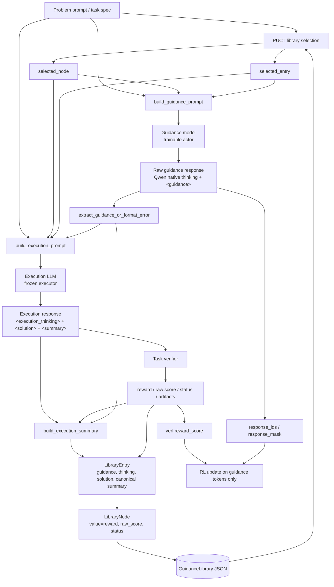

# Guidance-TTT Prompt Architecture

本文档按当前代码整理 `guidance-ttt` 的 prompt 架构，覆盖 guidance model、execution
model、execution 自总结、verifier 和 library writeback 的完整信息流。当前支持
`summary_only`（默认、兼容旧实验）和 `code_delta`（完整代码加增量摘要）两种模式。

代码来源：

- `guidance_ttt/prompts.py`: guidance/execution prompt 模板、raw summary attach、tag parser
- `guidance_ttt/tasks/__init__.py`: task registry、task-specific prompt/verifier/objective 配置
- `guidance_ttt/agent_loop.py`: verl agent loop、模型调用、verification、canonical summary、library 写回
- `guidance_ttt/library.py`: PUCT node selection、visible context、JSON library
- `guidance_ttt/verifier/erdos.py`: Erdos verifier、reward/raw score 计算
- `guidance_ttt/verifier/polyomino.py`: Polyomino C++ `<solution>` 提取和 FrontierCS result mapping
- `guidance_ttt/verifier/frontiercs_adapter.py`: 外部 FrontierCS/go-judge/Docker evaluator adapter

## Overall Structure



核心隔离规则：

```text
visible_timestep_exclusive = global_step
```

每个 rollout 只能看到 `timestep < global_step` 的 library 内容。同一个 training step 中刚
产生的其它 rollout 不会进入当前 prompt。

## One Rollout Flow

```text
GuidanceLibrary.acquire_group(
    group_uid,
    visible_timestep_exclusive=global_step,
    require_solution=True,
)
  -> selected_node chosen by PUCT from code-bearing nodes

GuidanceLibrary.context_for_node(selected_node, visible_timestep_exclusive=global_step)
  -> selected_entry

build_guidance_prompt(...)
  -> guidance chat messages
  -> guidance model may use Qwen native thinking, then outputs <guidance>...</guidance>

extract_guidance_or_format_error(...)
  -> parsed guidance
  -> guidance_format_ok

build_execution_prompt(...)
  -> execution chat messages
  -> execution model outputs <execution_thinking>, <solution>, <summary>

task_spec.verify_execution_text(execution_text)
  -> verifier status / task raw score / reward / artifacts

summary_only: build_execution_summary(...)
  -> canonical summary combining execution thinking, model summary, solution, guidance, verifier result

code_delta: raw <summary>
  -> store only the change from the selected parent

GuidanceLibrary.submit_child(...)
  -> write LibraryEntry and child LibraryNode
```

## Shared Library Context

Guidance prompt 和 execution prompt 来自同一次 PUCT selection 的同一个
`selected_node` / `selected_entry`，但使用两个不同的 library view。

共同来源：

```python
selected_node = library.acquire_group(...)
context = library.context_for_node(selected_node, ...)
selected_entry = context["selected_entry"]
```

- `summary_only` Guidance prompt attach raw model `<summary>` plus verifier
  score/status/message，不读取 `entry.solution` 或 canonical `entry.summary`。
- `code_delta` Guidance prompt attach 完整 `entry.solution`、raw model change summary 和
  verifier score/status/message。code 是完整事实来源，summary 只描述相对 parent 的变化。
- Execution prompt attach 完整 `entry.solution` plus verifier score/status/message，不读取 raw
  summary 或 canonical summary，也不对 parent code 做摘录或截断。
- 两个 prompt 都不 attach global best summary；它们只读取同一个 PUCT-selected entry 的
  task-specific view。
- 两个 prompt 都不 attach node id、visits、verified artifacts、previous guidance、
  reusable idea、failure mode 或 root initial construction facts。
- Execution prompt 额外 attach 当前 parsed `<guidance>`，要求基于 parent code 输出一个完整
  更新后的程序，而不是 patch。
- 当前 `global_best_entries`、`lineage_entries` 和 `local_failure_entries` 会由 library context
  返回，但没有直接写入 prompt，也不再用于 guidance objective 文本。

## Prompt Modes

配置入口：

```yaml
ttt:
  prompt_mode: summary_only  # default
```

切换新模式：

```yaml
ttt:
  prompt_mode: code_delta
```

非 bootstrap library entry 会记录 `metadata.prompt_mode`。resume 时，代码会拒绝把
`summary_only` 和 `code_delta` 的非 bootstrap entries 混在同一 run 中。timestep 0 的固定
seed 可以没有 mode 标记，并被视为 baseline。

## Summary-Only Library View

Guidance 使用 `_raw_summary_for_prompt(entry, fallback=...)`。这里的 “raw summary” 指
execution model 原始 `<summary>`，不是 `LibraryEntry.summary` 里的 canonical summary。

没有 previous entry 时：

```text
No previous summary is attached.
```

有 entry 时，attach helper 按优先级取 summary：

```text
1. entry.metadata["raw_model_summary"]
2. entry.metadata["execution_text"] 中的 <summary>...</summary>
```

如果有 raw summary，则 attach：

```text
{raw model summary}

Verifier status: {entry.verifier_status}
{task raw score label}: {entry.verifier_raw_score}
Reward: {entry.verifier_reward}
Verifier message: {entry.verifier_message}
```

如果 entry 存在但 raw summary 缺失，则 attach：

```text
No previous summary is attached.

Verifier status: {entry.verifier_status}
{task raw score label}: {entry.verifier_raw_score}
Reward: {entry.verifier_reward}
Verifier message: {entry.verifier_message}
```

该 helper 不做 clipping、implementation fact extraction 或 profile compaction。缺少 raw
summary 的老 entry 不会 fallback 到 canonical `entry.summary`。

Execution 使用 `_parent_code_for_prompt(...)`，attach：

````text
<selected_parent>
Verifier status: {entry.verifier_status}
{task raw score label}: {entry.verifier_raw_score}
Reward: {entry.verifier_reward}
Verifier message: {entry.verifier_message}

<parent_code>
```{python_or_cpp}
{entry.solution}
```
</parent_code>
</selected_parent>
````

`selected_entry` 缺失或 `solution` 为空时不会 fallback 到 summary 或从零生成。PUCT 会先
跳过无代码节点；如果没有任何可见的 code-bearing node，rollout 在 guidance generation
之前明确失败并要求使用有效 bootstrap library。

## Task Registry

当前 loop 通过 `task.id` 获取 `TaskSpec`。Erdos 和 Polyomino 共用同一个
guidance/execution/library/PUCT 流程，差异只放在 task spec 中。

```python
TaskSpec(
    task_id=...,
    problem_prompt=...,
    solution_language=...,          # "python" or "cpp"
    execution_solution_contract=...,
    score_direction=...,            # "min" or "max"
    raw_score_label=...,            # e.g. "Raw C5" or "FrontierCS score"
    create_root_node=...,
    verifier=...,
    solution_extractor=...,
    guidance_objective=...,
)
```

Configured tasks:

- `erdos_min_overlap`: execution outputs Python `run()`, lower raw C5 is better,
  reward is `1 / (1e-8 + C5)`.
- `polyomino_packing`: execution outputs a full C++17 program, evaluation always
  goes through external FrontierCS/go-judge/Docker, higher FrontierCS score is better.

## Guidance Model Prompt

Guidance model 是被 RL 训练的 actor。它不直接写最终 solution，而是输出下一步
搜索方向。verl 的 reward 最终只作用在 guidance model response tokens 上。

### Guidance System Prompt

```text
You are the Guidance Model, acting as a strategic navigator for an open-ended scientific discovery process.

Your primary objective is to provide **evolutionary guidance**. Do not write final code or focus on low-level implementation details. Instead, your task is to propose high-level directional shifts, conceptual mutations, and novel pathways to explore the search space.
```

### Guidance User Prompt

下面是 `build_guidance_prompt(...)` 当前构造的完整 user prompt。`{...}` 是运行时
Python f-string 插入的变量。

````text
<problem>
{problem_prompt}
</problem>

The next sections describe the current search state for this problem. Use them
as run-local context when deciding the next step.

<selected_summary>
{_raw_summary_for_prompt(selected_entry, fallback="No previous summary is attached.")}
</selected_summary>

# Objective
{objective_text}

# Evolutionary Guidelines
1. Analyze the search history.
   Use `<selected_summary>` to identify what has already been tried, what worked, and what bottleneck the next attempt should address.

2. Stay at the algorithmic-strategy level.
   Propose high-level algorithmic directions, strategic refinements, or changes
   to important algorithmic components. The next attempt does not need to replace
   the current algorithm entirely: if the overall approach is promising, it is
   equally valuable to improve specific strategies, mechanisms, or design choices
   that may address the identified bottleneck. Do not write code, low-level
   implementation details, or parameter schedules.

3. Propose only executable mechanisms.
   {mechanism_constraint}

4. Produce exactly the required XML structure.
   Provide internal reasoning and return exactly one `<guidance>` block and no other custom XML blocks, commentary, code, or markdown.

Please do internal reasoning and provide your response exactly in the following format:

<guidance>
Provide the final evolutionary guidance for the next execution attempt. Describe the main algorithmic direction and keep the guidance conceptual and actionable.
</guidance>
````

### Code-Delta Guidance Context

`code_delta` 使用同一个 system prompt 和后续 guidelines，但把历史部分替换为：

````text
<problem>
{problem_prompt}
</problem>

The next section contains the selected candidate's complete code, its incremental
summary, and its verified score. Treat the code as the authoritative description
of the current algorithm. The change summary describes only how this candidate
changed from its own parent; it is not a complete description of the code.

<selected_candidate>
<parent_code>
```{python_or_cpp}
{selected_entry.solution}
```
</parent_code>

<change_summary>
Summary type: {baseline_or_delta_from_parent}
{raw_model_summary}
</change_summary>

<score>
Verifier status: {selected_entry.verifier_status}
{raw_score_label}: {selected_entry.verifier_raw_score}
Reward: {selected_entry.verifier_reward}
Verifier message: {selected_entry.verifier_message}
</score>
</selected_candidate>
````

对应第一条 guideline 为：

```text
Use `<parent_code>`, `<change_summary>`, and `<score>` to identify what the candidate currently implements, what its previous refinement changed, and what bottleneck the next attempt should address.
```

### Guidance Runtime Variables

`objective_text`:

```python
objective_text = task_spec.guidance_objective(None)
```

`mechanism_constraint`:

```python
mechanism_constraint = task_spec.guidance_mechanism_constraint
```

Polyomino 的实际约束为：

```text
Every proposed mechanism must be implementable inside one self-contained C++17 program using only the current input instance. Do not rely on offline training data, benchmark access, external models, APIs, learned weights, or unavailable precomputation.
```

这条约束禁止 guidance 提议依赖不可用的 benchmark 训练数据、外部 predictor、API 或
未提供权重的 learned model。Erdős task 使用等价的 Python/runtime 版本，避免共享 prompt
错误要求 Python candidate 写成 C++17。

所以 guidance prompt 的历史内容是 raw model summary + verifier score。objective 文案和
score 方向由 task spec 控制。Erdos 使用 “Lower raw C5 is better”；Polyomino 使用
“Higher FrontierCS score is better”。

注意：`global_best_entries` 目前只为接口兼容和 library context 保留；global best 的
summary/code/method 不 attach，global best 的 score 也不再写入 objective。`local_failure_entries`
同样不展示给 guidance model。

### Guidance Parsing

`extract_guidance_or_format_error(...)` 的规则：

```text
If raw output has <guidance>...</guidance>:
  submitted guidance = text inside <guidance>
  guidance_format_ok = true
Else:
  submitted guidance = synthetic formatting-failure guidance
  guidance_format_ok = false
```

Qwen3 guidance actor 仍通过 chat template 开启 native thinking；prompt 不再要求
自定义 reasoning XML block，避免模型同时模仿两套 thinking 格式。

如果第一次 generation 解码后为空，agent loop 会 retry 一次，并记录
`guidance_generation_attempts`。

## Execution Model Prompt

Execution model 是冻结的执行器。它把 parsed guidance 和 library context 转成一个具体
可运行的 task-specific candidate。Erdos 输出 Python，Polyomino 输出 C++17。execution tokens 不参与 RL 更新；它的输出只通过 verifier 产生
reward，并写回 library。

实际发送给 execution model 的 chat messages：

```python
[
    {"role": "system", "content": execution_prompt.system},
    {"role": "user", "content": execution_prompt.user},
]
```

其中：

```python
execution_prompt = build_execution_prompt(
    problem_prompt=problem_prompt,
    selected_node=selected_node,
    selected_entry=selected_entry,
    guidance=guidance,
    solution_language=task_spec.solution_language,
    solution_contract=task_spec.execution_solution_contract,
    raw_score_label=task_spec.raw_score_label,
)
```

### Execution System Prompt

```text
You are the execution model. Improve the supplied parent C++17 candidate by applying the guidance, then return one complete runnable candidate.

Use the parent code as the implementation baseline. Follow the guidance faithfully, preserve unaffected working mechanisms, and keep the required input/output contract. Implement all specified algorithmic mechanisms and strategic details as precisely as possible. Do not silently omit, replace, or substantially simplify any important component. If an exact implementation is infeasible, use the closest valid alternative and explain the deviation in the summary.

Output execution thinking first, then the code block, then the summary.
```

### Execution User Prompt

下面是 `build_execution_prompt(...)` 当前构造的完整 user prompt。`<problem>` 是权威任务
定义，`<selected_parent>` 是要改进的可运行基线，`<guidance>` 是当前要执行的方向。

````text
<problem>
{problem_prompt}
</problem>

The next sections provide the selected parent candidate and the guidance for improving it.

<selected_parent>
Verifier status: {selected_entry.verifier_status}
{raw_score_label}: {selected_entry.verifier_raw_score}
Reward: {selected_entry.verifier_reward}
Verifier message: {selected_entry.verifier_message}

<parent_code>
```{python_or_cpp}
{selected_entry.solution}
```
</parent_code>
</selected_parent>

<guidance>
{prompt_guidance}
</guidance>

Use the problem statement as the authoritative task specification.
Use the selected parent code as the runnable baseline for this attempt.
Score direction: {score_direction}.

# Guidance Adherence Contract
Treat the guidance as the binding specification for improving the selected parent. Apply its proposed algorithmic mechanisms and strategic refinements as faithfully and completely as possible while preserving the parent candidate's working behavior outside the requested changes.

Modify the supplied parent code rather than replacing it with a generic baseline or an unrelated implementation. Preserve its input/output contract and unaffected working mechanisms. Every important actionable component in the guidance must be reflected concretely in the new solution and must interact as intended. Return one complete updated program, not a patch or diff.

{solution_contract}

Your response must contain exactly three top-level XML blocks and no extra text before, between, or after them.
You must output all three XML blocks exactly as shown below.
The <execution_thinking>...</execution_thinking> block is mandatory and must use angle brackets.
The <solution> block is mandatory and must contain a fenced ```{python_or_cpp} code block.
The <summary>...</summary> block is mandatory and must be closed.
Do not output only execution_thinking, only a summary, or plain natural language.
Do not omit angle brackets from XML tags.

Required output format:

<execution_thinking>
A short explanation of how the guidance was converted into the submitted algorithm.
Do not include code.
</execution_thinking>

<solution>
```{python_or_cpp}
{placeholder}
```
</solution>

<summary>
Write a concise natural-language summary of the candidate.

The summary should explain:

1. the implemented algorithmic idea;
2. exactly what was changed from the supplied parent code in response to the guidance and what important mechanisms were preserved;
3. the main search, refinement, or optimization mechanisms actually used.

Include enough information for a later model to understand the candidate’s overall algorithmic approach from the summary alone.

Only describe mechanisms that are present in the implementation. If a guidance-suggested component was not implemented, explicitly say that it was simplified, approximated, or omitted. Focus on conceptually important implementation choices and do not include source code.

</summary>

Any response that does not follow this exact three-block structure should be treated as invalid.
````

在 `code_delta` 模式中，只有 `<summary>` 内的说明发生变化；parent code、guidance adherence
contract 和三个严格 XML blocks 保持不变：

```text
<summary>
Write a concise natural-language summary only of how the submitted solution differs from the supplied parent code.

The summary should explain:

1. what algorithmic mechanisms or strategies were concretely changed;
2. how those changes implement the supplied guidance;
3. which guidance-suggested components were simplified, approximated, or omitted.

Do not re-summarize the complete algorithm or list unchanged mechanisms, except when an unchanged invariant is essential to explain the modification. Describe only mechanisms that are actually present in the submitted solution. Do not include source code, code fences, copied constants, hard-coded arrays, raw candidate parameters, benchmark-specific profile values, or the output-format instructions.
</summary>
```

### Bootstrap Execution Prompt

`build_bootstrap_execution_prompt(...)` is used only by the explicit
`--bootstrap-only` pre-training step. It does not attach library history or
guidance; its output seeds the root library node so step 1 has both selected
code for execution and a selected summary for guidance.

For Polyomino Modal experiments that should not spend an execution call on
every launch, `ttt.bootstrap.seed_library_path` can point to a fixed JSON
library. The recommended GPT-OSS-120B recipe uses:

```text
guidance_ttt/seeds/polyomino_packing/gpt_oss_120b_bootstrap_library.json
```

When the output `library.json` does not exist, `prepare_run(...)` copies that
seed library directly. If `library.json` already exists, it is left untouched.

````text
<problem>
{problem_prompt}
</problem>

You are generating the initial bootstrap candidate for a Guidance-TTT run.

There is no previous library summary and no guidance yet. Produce one concrete baseline solution that satisfies the problem statement and can seed the future search history.

{solution_contract}

Your response must contain exactly three top-level XML blocks and no extra text before, between, or after them.

Required output format:

<execution_thinking>
A short explanation of the baseline strategy used to produce the initial candidate.
Do not include code.
</execution_thinking>

<solution>
```{python_or_cpp}
{placeholder}
```
</solution>

<summary>
A concise natural-language summary of the candidate.

This summary must describe the implemented baseline algorithm, the main construction/search/refinement mechanism, and what future guidance could improve. If the solution intentionally uses a simple heuristic rather than a full optimization method, state that clearly.

Do not include source code, code fences, copied constants, hard-coded arrays, raw candidate parameters, benchmark-specific profile values, or the output-format instructions themselves.
</summary>

Any response that does not follow this exact three-block structure should be treated as invalid.
````

### Execution Runtime Variables

因此 execution model 和 guidance model 始终使用同一个 PUCT-selected parent。在
`code_delta` 模式中，guidance 看 parent code + change summary + score，execution 看 parent
code + parsed guidance + score；execution 不重复接收 parent summary。两个 prompt 都不 attach
visible global best。

### Execution Parsing

Execution response 预期包含三个 blocks：

```text
<execution_thinking>...</execution_thinking>
<solution>```python ... ```</solution>    # Erdos
<solution>```cpp ... ```</solution>       # Polyomino
<summary>...</summary>
```

解析方式：

- `execution_thinking = extract_tag_or_none(execution_text, "execution_thinking") or ""`
- `solution = _extract_solution_code(execution_text, task_spec=task_spec)`
- `model_summary = extract_terminal_tag_or_none(execution_text, "summary")`

`_extract_solution_code(...)` 优先读取 `<solution>...</solution>`，再调用 task-specific
extractor。Erdos 接受 Python fenced code；Polyomino 只接受 `cpp` / `c++` / `C++` fenced code。

Verifier 通过 task spec 对完整 `execution_text` 调用：

```python
verification = task_spec.verify_execution_text(
    execution_text,
    timeout_s=timeout_s,
    config=task_verifier_config,
)
```

Erdos verifier 要求 candidate code 定义 `run()`，并返回：

```python
h_values, c5_bound, n_points
```

valid 时：

```text
raw_score = verified C5
reward = 1.0 / (1e-8 + raw_score)
status = "valid"
artifacts = code, h_values, c5_bound, n_points
```

invalid/parse error/timeout 时：

```text
reward = 0.0
raw_score = None
status = "parse_error" / "invalid" / "timeout"
```

Polyomino verifier 要求 `<solution>` 中存在 C++17 fenced block，并把 C++ code 交给外部
FrontierCS evaluator：

```text
valid:
  raw_score = FrontierCS score
  reward = FrontierCS score
  status = "valid"

invalid:
  reward = 0.0
  raw_score = None
  status = "invalid"

environment unavailable:
  reward = 0.0
  raw_score = None
  status = "environment_error"
```

没有本地 smoke evaluator；FrontierCS 不 vendored 到 `guidance/`。

## Summary Writeback

`summary_only` 模式下，execution model 的 `<summary>` 不是最终直接写入 library 的唯一
summary。agent loop 会在 verification 之后调用 `build_execution_summary(...)`，把 model
summary、execution thinking、solution、guidance 和 verifier 真实结果合成 canonical summary。

`code_delta` 模式不调用 canonical wrapper。严格提取出的原始 `<summary>` 同时写入
`LibraryEntry.summary` 和 `metadata.raw_model_summary`，完整代码只存放在
`LibraryEntry.solution`。缺失 summary 时保持为空，不合成替代文本。

固定 sections：

```text
Execution Interpretation
Implemented Algorithm
New Ideas Introduced
Empirical Outcome
Failure / Bottleneck Analysis
Next Guidance Delta
```

`Empirical Outcome` 由 verifier 填充：

```text
Verifier status: {verification.status}
{task_spec.raw_score_label}: {verification.raw_score}
Reward: {verification.reward}
Verifier message: {verification.message}
Verified returned profile: n_points=..., c5_bound=..., h length=..., head=[...], tail=[...]
```

如果 model summary 没有可解析 section，原始 `<summary>` 会作为 `New Ideas Introduced`。
如果 verifier invalid，`Failure / Bottleneck Analysis` 会记录真实 failure status/message。

## Library Writeback

每个 rollout 写入一个 `LibraryEntry`：

```python
LibraryEntry(
    id=str(uuid4()),
    parent_id=selected_node.id,
    problem_id=selected_node.problem_id,
    timestep=int(global_step),
    guidance=guidance,
    execution_thinking=execution_thinking,
    solution=solution,
    verifier_reward=verification.reward,
    verifier_raw_score=verification.raw_score,
    verifier_status=verification.status,
    verifier_message=verification.message,
    summary=summary,  # canonical summary or raw delta summary, selected by prompt_mode
    reusable_idea=summary if prompt_mode == "code_delta" else _extract_reusable_idea(summary),
    failure_mode=None if verification.valid else verification.status,
    metadata={
        "group_uid": group_uid,
        "selected_node_id": selected_node.id,
        "selected_parent_entry_id": selected_entry.id,
        "selected_parent_solution_sha256": sha256(selected_entry.solution),
        "selected_parent_solution_chars": len(selected_entry.solution),
        "guidance_format_ok": guidance_format_ok,
        "guidance_generation_attempts": guidance_generation.attempts,
        "guidance_prompt_tokens": len(prompt_ids),
        "guidance_response_tokens": len(response_ids),
        "raw_guidance_with_specials": guidance_generation.raw_text,
        "guidance_stop_reason": guidance_generation.stop_reason,
        "raw_guidance_text": guidance_text,
        "guidance_prompt": {"system": guidance_prompt.system, "user": guidance_prompt.user},
        "execution_prompt": {"system": execution_prompt.system, "user": execution_prompt.user},
        "task": task_config,
        "execution_text": execution_text,
        "raw_model_summary": raw_model_summary,
        "prompt_mode": prompt_mode,
        "summary_semantics": "delta_from_parent" or "canonical_full_candidate",
        "execution_provider": self.execution_llm_config.get("provider", "mock"),
        "execution_model": self.execution_llm_config.get("model", "mock-exec"),
        "execution_response_metadata": execution_response_metadata,
        "execution_response_usage": execution_response_usage,
        "verification_artifacts": verification.artifacts,
        "execution_fallback_used": execution_result.fallback_used,
        "execution_fallback_reason": execution_result.fallback_reason,
        "original_execution_text": execution_result.original_execution_text,
    },
)
```

同时写入一个 child `LibraryNode`：

```python
LibraryNode(
    problem_id=entry.problem_id,
    timestep=entry.timestep,
    entry_id=entry.id,
    value=entry.verifier_reward,
    raw_score=entry.verifier_raw_score,
    visits=0,
    parent_id=selected_node.id,
    children=[],
    metadata={"verifier_status": entry.verifier_status},
)
```

`submit_child(...)` 在 group 完成后更新 PUCT stats，并可能过滤 archive：

```text
puct_n: visit counts
puct_m: best reachable values
puct_T: total completed group visits
```

PUCT expansion 只在有非空 `entry.solution` 的节点中选择 parent。没有代码的 invalid rollout
仍保存在 library 中用于 reward 和审计，但不能成为下一轮 execution parent。Polyomino
candidate dedup 使用规范化 solution 的 SHA-256，因此相同代码不会因为 summary 措辞不同而
占据多个 archive slot。

PUCT 的 Q 值现在不是纯 child-best。未访问 node 使用自身 reward；已访问且存在
`puct_m` 时使用：

```text
Q = 0.8 * own_reward + 0.2 * best_reachable_child_reward
```

这样可以避免高分 parent 只因为一次较差 child 就被子树分数完全覆盖，同时仍保留子树
改进信号。

## Training Signal

Guidance model 是唯一被训练的模型：

```text
prompt_ids = guidance system + guidance user
response_ids = guidance model response tokens
response_mask = [1] * len(response_ids)
reward_score = verification.reward
```

Execution model、verifier、summary canonicalizer 都只提供 environment feedback。execution
失败不会被固定 fallback solution 替换；失败会以 reward `0.0` 和对应 status 写入 library，
成为后续 guidance prompt 的历史信号。
